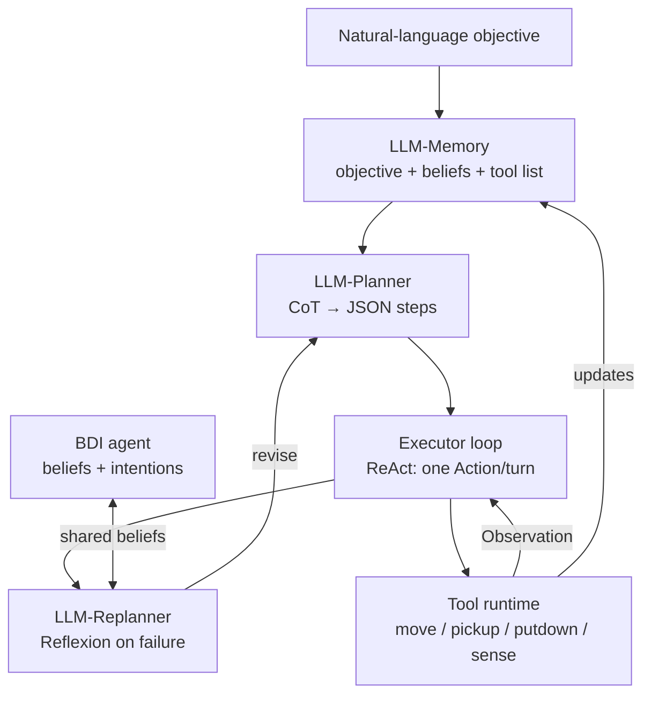

# Integrating the LLM Agent

**Part 2 of the Autonomous Software Agents project — a concrete plan grounded in `lab8-LLMs`**

*Autonomous Software Agents 2025–2026 | University of Trento*

---

## 1. Why this document

Part 1 of the project delivered a working **BDI agent** (beliefs, deliberation, an order-sensitive plan library, A\* movement and a PDDL crate-pushing detour). Part 2 asks for an **LLM-based agent** that takes high-level objectives in natural language, reasons over a memory of observations and a tool catalogue, produces a plan of *tool invocations*, and **cooperates with the BDI agent**. This note distils the official `lab8-LLMs` reference code into a recipe for our codebase: the theory behind each piece, and the concrete shape the JavaScript should take.

## 2. What lab8 actually teaches

The lab is a 9-step ladder of `.mjs` files. Stripped of the toy examples, three design decisions matter for us:

1. **The LLM is reached through an OpenAI-compatible endpoint** (the faculty LiteLLM proxy). The same `openai` client library and message format work unchanged.
2. **Tools are plain functions** collected in a dictionary. The model never touches the game; it *names* a tool and the runtime executes it. This is exactly the indirection we need so the LLM can drive the Deliveroo SDK safely.
3. **Reasoning is a text protocol**, not native function-calling. The lab uses the **ReAct** format (`Thought / Action / Action Input / Observation`) parsed with regexes, and a **Planner → Executor** split for multi-step tasks.

> **Endpoint configuration (identical across every lab file)**
>
> ```javascript
> import OpenAI from "openai";
> const client = new OpenAI({
>   baseURL: process.env.LITELLM_BASE_URL,   // https://llm.bears.disi.unitn.it/v1
>   apiKey:  process.env.LITELLM_API_KEY,     // your faculty token
> });
> const MODEL = process.env.LOCAL_MODEL || "llama-3.3-70b-lmstudio";
>
> async function callModel(messages, { temperature = 0 } = {}) {
>   const r = await client.chat.completions.create({ model: MODEL, messages, temperature });
>   return r.choices?.[0]?.message?.content ?? "";
> }
> ```

**Note:** although the lab *mentions* OpenAI native `tools`/`tool_calls`, every solution file (including the Deliveroo one) actually uses the **manual text protocol**. It is model-agnostic and works with the locally-hosted Llama model, so we adopt it too.

## 3. The theory in one page

- **Chain-of-Thought (CoT).** Ask the model to write its reasoning before its answer. In the lab this is the literal `Thought:` line. It improves multi-step decisions at the cost of tokens.
- **ReAct (Reason + Act).** Interleave reasoning with actions: `Thought → Action → Observation → Thought → …`. The model emits *one* action, the runtime executes it, feeds back an `Observation`, and loops. This is the backbone of the lab's execution loop and the natural fit for a partially observable game where each move reveals new tiles.
- **Planner / Executor.** For requests that need several steps, a *planner* prompt first decomposes the objective into a short JSON list of steps; an *executor* prompt then runs each step with its own ReAct mini-loop. This separates "what to do" from "how to do it" and keeps each prompt small.
- **Reflexion / Replanning.** When an action fails (a blocked tile, an expired parcel), the failure observation is fed back so the model revises its plan rather than repeating the mistake. Our BDI side already does this structurally (intention revision); on the LLM side it is a prompt-level feedback loop.

## 4. Reference architecture



*The LLM agent loop. The `LLM-*` nodes are LLM-driven prompts; the tool runtime is deterministic. The dashed link is the multi-agent channel to our existing BDI agent.*

This maps cleanly onto the three components the project brief requires: **LLM-Memory**, **LLM-Planner** (CoT), and **LLM-Replanner** (ReAct/Reflexion).

## 5. Concrete implementation for our codebase

### 5.1 Wrap the Deliveroo SDK as tools

The lab's Deliveroo file exposes four tools; the agent only ever calls these. We extend the set to the full action vocabulary from `docs/Context.md` §3.1. Crucially, tools return a *string observation* — including failures — so the ReAct loop can react.

```javascript
import { DjsConnect } from "@unitn-asa/deliveroo-js-sdk/client";
const socket = DjsConnect(process.env.HOST, process.env.TOKEN);

const me = { id: null, x: null, y: null, score: 0 };
socket.onYou(you => Object.assign(me, you));

// Live beliefs the LLM can read (kept tiny on purpose)
const parcels = new Map();              // id -> {x,y,reward,carriedBy}
socket.onParcelsSensing(ps => { for (const p of ps) parcels.set(p.id, p); });

async function move(direction) {
  const d = direction.trim().toLowerCase();
  if (!["up","down","left","right"].includes(d))
    return `Error: invalid direction '${direction}'.`;
  const res = await socket.emitMove(d);
  return res ? `Moved ${d}. New position: ${JSON.stringify(res)}.`
             : `Error: move ${d} blocked (tile occupied or wall).`;
}
async function pick_up()  { const n = await socket.emitPickup();  return `Picked up ${n?.length ?? 0} parcel(s).`; }
async function put_down() { const n = await socket.emitPutdown(); return `Put down ${n?.length ?? 0} parcel(s).`; }
async function get_my_position() { return JSON.stringify(me); }
async function sense_parcels() {
  const free = [...parcels.values()].filter(p => !p.carriedBy);
  return free.length ? JSON.stringify(free) : "No parcels currently in view.";
}

const TOOLS = { move, pick_up, put_down, get_my_position, sense_parcels };
```

### 5.2 The ReAct executor loop

This is the heart of the lab (file `07A`/`9_07C`). The model emits exactly one `Action`; we execute it, append an `Observation`, and iterate up to a cap.

```javascript
function extractAction(t) {
  const a = t.match(/^Action:\s*(.+)$/im);
  const i = t.match(/^Action Input:\s*(.+)$/im);
  return (a && i) ? { action: a[1].trim(), input: i[1].trim() } : null;
}
function extractFinal(t) { const m = t.match(/^Final Answer:\s*([\s\S]*)$/im); return m ? m[1].trim() : null; }

async function runLoop(messages, maxIters = 8) {
  for (let i = 0; i < maxIters; i++) {
    const out = await callModel(messages, { temperature: 0 });
    messages.push({ role: "assistant", content: out });

    const act = extractAction(out);
    if (act) {
      const fn = TOOLS[act.action];
      const obs = fn ? await fn(act.input)
                     : `Error: unknown tool '${act.action}'. Available: ${Object.keys(TOOLS).join(", ")}`;
      messages.push({ role: "user", content: `Observation: ${obs}` });
      continue;                       // ReAct: act, observe, think again
    }
    const done = extractFinal(out);
    if (done) return done;
    messages.push({ role: "user", content: "Observation: invalid format. Output one Action or one Final Answer." });
  }
  return "Stopped: iteration limit reached.";
}
```

### 5.3 The system prompt: memory + tools + protocol

The prompt *is* the LLM-Memory: it fuses the natural-language objective, a live snapshot of beliefs, the tool catalogue, and the strict output contract. Regenerate the belief snapshot each turn so the model always reasons over current state.

```javascript
function systemPrompt() {
  return [
    "You control a Deliveroo delivery agent on an MxN grid.",
    "Goal: maximise score by picking up parcels and delivering them to delivery tiles.",
    "",
    "World state (refreshed each turn):",
    `- Me: ${JSON.stringify(me)}`,
    `- Parcels in view: ${[...parcels.values()].map(p=>`(${p.x},${p.y}) r=${p.reward}`).join(", ") || "none"}`,
    "",
    "Tools: move(up|down|left|right), pick_up(), put_down(), get_my_position(), sense_parcels().",
    "Movement: up y+1, down y-1, right x+1, left x-1; one tile per call; a blocked tile fails.",
    "",
    "Output EXACTLY one of:",
    "  Thought: <reasoning>",        // Chain-of-Thought
    "  Action: <tool>",
    "  Action Input: <arg or none>",
    "OR, when the objective is done:",
    "  Thought: <reasoning>",
    "  Final Answer: <summary>",
    "Never invent tool results. Never output two Actions at once.",
  ].join("\n");
}
```

### 5.4 Planner for multi-step objectives (CoT)

For objectives like *"collect the two nearest parcels then deliver"* the lab first plans, then executes. The planner returns strict JSON; a fallback covers malformed output.

```javascript
const PLANNER_PROMPT = `You decompose a Deliveroo objective into 1-10 concrete steps.
Return ONLY JSON: {"steps":["step 1","step 2"]}  No markdown, no prose.`;

async function createPlan(objective) {
  const raw = await callModel(
    [{ role:"system", content: PLANNER_PROMPT }, { role:"user", content: objective }]);
  try { const p = JSON.parse(raw.replace(/```json|```/g,"").trim());
        if (Array.isArray(p.steps) && p.steps.length) return p; } catch {}
  return { steps: [objective] };                        // graceful fallback
}
```

### 5.5 Replanning / Reflexion

The executor already feeds failures back as `Observation`s, which is lightweight Reflexion. Strengthen it by detecting repeated failures and re-invoking the planner with the failure log appended — the trigger conditions the brief lists (clock advanced, obstacle, objective overridden) become explicit replan calls:

```javascript
if (consecutiveBlocked >= 2) {
  const note = `Previous attempt failed: ${lastObservation}. Replan around the obstacle.`;
  plan = await createPlan(`${objective}\n\nConstraint: ${note}`);
}
```

## 6. Multi-agent coordination (BDI ↔ LLM)

The brief (§4.2) requires the two agents to exchange beliefs and divide tasks. Two practical channels, in increasing ambition:

- **Shared belief object.** Run both agents in one process (we already spawn several via `multiple_run.js`); export the BDI `parcels`/`me` beliefs and let the LLM's `sense_parcels` tool read the *union* of both agents' views — this gives the LLM visibility over hidden map regions the BDI agent has seen.
- **SDK `say`/`shout` messaging.** Use the Deliveroo communication channel so the agents negotiate: when a parcel is discovered, each agent reports its distance and the closer one claims it. The LLM is well suited to phrasing/parsing these natural-language hand-offs, while the BDI agent contributes precise A\* distances.

A clean rule of thumb: **BDI for fast, deterministic execution; LLM for high-level objective interpretation and coordination**. The LLM's `move`/`pick_up` tools can even delegate to the existing `astar.js` `navigateTo()` instead of single steps, reusing Part 1 wholesale.

## 7. Suggested file layout

Add an `llmAgent/` sibling to `myAgent/`, reusing context and beliefs:

```
llmAgent/
  llmClient.js     // OpenAI/LiteLLM wrapper + callModel()
  tools.js         // TOOLS dict wrapping the SDK (and optionally astar.navigateTo)
  memory.js        // systemPrompt() = objective + live beliefs + tool catalogue
  planner.js       // createPlan() (CoT, strict JSON)
  executor.js      // runLoop() (ReAct), replan trigger (Reflexion)
  coordination.js  // belief sharing + say/shout negotiation with the BDI agent
  llmAgent.js      // entry: read NL objective -> plan -> execute -> report
.env               // LITELLM_BASE_URL, LITELLM_API_KEY, LOCAL_MODEL, HOST, TOKEN, NAME
```

> **Minimal milestone order**
>
> **(a)** endpoint + `callModel` → **(b)** four SDK tools + ReAct loop (reproduce lab `9_07C`) → **(c)** planner/executor split → **(d)** Reflexion replanning → **(e)** BDI belief sharing + negotiation. Each step is independently demonstrable.

---

*Source: `unitn-ASA/DeliverooAgent.js/lab8-LLMs` (files `04`–`09`, notably `9_07C_DeliverooAgent.mjs` and `09_08B-planner-execution-loop_DeliverooJS_EXTRA.mjs`) and project `docs/Context.md`.*
